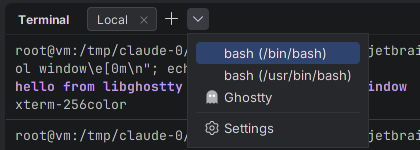
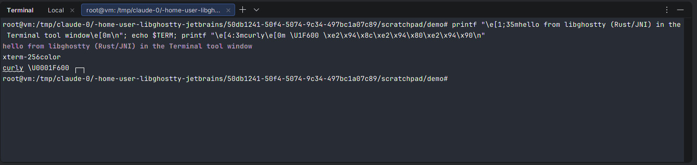

# Ghostty Terminal for JetBrains IDEs

A terminal for IntelliJ IDEA, PyCharm, GoLand, WebStorm, Rider, CLion and the other
JetBrains IDEs, built on [libghostty](https://ghostty.org): the terminal emulation
core of the [Ghostty](https://github.com/ghostty-org/ghostty) terminal.

All escape sequence parsing and terminal state (screen, scrollback, reflow, modes,
selection, search, key and mouse encoding) is done by **libghostty-vt**. The plugin
adds a pty, a Java2D renderer of libghostty's render state, and IDE integration.


| | |
|---|---|
|  |  |
|  | |

## Features

**Terminal emulation (libghostty-vt)**
- xterm-compatible VT parsing and state, 256 colors and truecolor, all SGR styles
  (curly/dotted/dashed/double underlines, underline colors, overline, strikethrough, faint)
- Kitty keyboard protocol, xterm `modifyOtherKeys`, application cursor/keypad modes
- Mouse reporting (X10, normal, button, any-event; SGR, SGR-pixels, UTF-8, urxvt)
- Synchronized output (mode 2026) without tearing, focus reporting, bracketed paste
- Grapheme clustering (emoji ZWJ sequences, flags, combining marks) and wide characters
- Reflow on resize and a scrollback limited by memory, not lines
- OSC 8 hyperlinks, OSC 7 working directory, OSC 52 clipboard, OSC 9/777 notifications,
  OSC 9;4 progress, OSC 133 semantic prompts, color scheme reports (mode 2031)

**IDE integration**
- *Ghostty* tool window with tabs, *New Ghostty Tab* and **Open in Ghostty Terminal** for
  any file or directory (Project view, editor tabs, *Open In* menu)
- **Ghostty in the built-in Terminal tool window**: pick *Ghostty* from the Terminal's
  new-tab dropdown (<kbd>+</kbd> ▾), or set *Open new tabs in: Terminal tool window* so every
  Ghostty tab lands there (see [below](#the-built-in-terminal-tool-window) for what this
  can and can't do)
- Colors follow the IDE's console color scheme (or use Ghostty's defaults, or any
  Ghostty theme / config file) and update live when the scheme changes
- Font follows the editor's console font; zoom with <kbd>Ctrl</kbd>+wheel
- IDE shortcuts are sent to the terminal while it has focus (so <kbd>Ctrl</kbd>+<kbd>R</kbd>,
  <kbd>Ctrl</kbd>+<kbd>W</kbd>, <kbd>Esc</kbd>… reach your shell), except window and
  navigation actions like *Search Everywhere* or *Hide Active Window*
- <kbd>Ctrl</kbd>/<kbd>Cmd</kbd>+click URLs and `path/to/file.kt:12:3` references; files
  open in the editor at that line
- Find in screen and scrollback (<kbd>Ctrl</kbd>+<kbd>Shift</kbd>+<kbd>F</kbd> /
  <kbd>Cmd</kbd>+<kbd>F</kbd>), selection with Ghostty's click/double-click/triple-click
  and drag gestures, copy-on-select, middle-click paste on Linux
- Paste protection for text that would run commands, drag & drop files to paste paths
- Box-drawing, block elements and Powerline separators drawn geometrically so TUIs line
  up perfectly regardless of the font
- Program notifications become IDE notifications; progress reports show in the tab title

### Keyboard shortcuts in the terminal

| Action | Linux / Windows | macOS |
|---|---|---|
| Copy | <kbd>Ctrl</kbd>+<kbd>Shift</kbd>+<kbd>C</kbd> (or <kbd>Ctrl</kbd>+<kbd>C</kbd> with a selection) | <kbd>Cmd</kbd>+<kbd>C</kbd> |
| Paste | <kbd>Ctrl</kbd>+<kbd>Shift</kbd>+<kbd>V</kbd>, <kbd>Shift</kbd>+<kbd>Insert</kbd> | <kbd>Cmd</kbd>+<kbd>V</kbd> |
| Find | <kbd>Ctrl</kbd>+<kbd>Shift</kbd>+<kbd>F</kbd> | <kbd>Cmd</kbd>+<kbd>F</kbd> |
| Select all | context menu (<kbd>Ctrl</kbd>+<kbd>Shift</kbd>+<kbd>A</kbd> stays *Find Action*) | <kbd>Cmd</kbd>+<kbd>A</kbd> |
| New / close tab | <kbd>Ctrl</kbd>+<kbd>Shift</kbd>+<kbd>T</kbd> / <kbd>W</kbd> | <kbd>Cmd</kbd>+<kbd>T</kbd> / <kbd>W</kbd> |
| Font size | <kbd>Ctrl</kbd>+<kbd>Shift</kbd>+<kbd>=</kbd> / <kbd>-</kbd> / <kbd>0</kbd> | <kbd>Cmd</kbd>+<kbd>=</kbd> / <kbd>-</kbd> / <kbd>0</kbd> |
| Clear scrollback | context menu | <kbd>Cmd</kbd>+<kbd>K</kbd> |
| Scroll | <kbd>Shift</kbd>+<kbd>PgUp</kbd>/<kbd>PgDn</kbd>/<kbd>Home</kbd>/<kbd>End</kbd> | same |

Settings live in **Settings | Tools | Ghostty Terminal**.

## The built-in Terminal tool window

JetBrains' Terminal plugin has **no extension point for swapping its terminal engine**,
so Ghostty can't be selected as "the" backend that <kbd>Alt</kbd>+<kbd>F12</kbd> or the
plain <kbd>+</kbd> button use. What the plugin does instead, through public APIs only:

- registers an `openPredefinedTerminalProvider`, so **Ghostty** appears in the Terminal
  tool window's new-session dropdown (<kbd>+</kbd> ▾) next to the detected shells;
- hosts Ghostty tabs inside the Terminal tool window, side by side with the built-in
  terminal's own tabs (Settings → *Open new tabs in*).

| | |
|---|---|
|  |  |

The integration is an optional dependency: without the Terminal plugin (e.g. in
some IDEs or when it's disabled) the Ghostty tool window keeps working on its own.
The built-in terminal's own tab actions (rename session, split, …) don't apply to
Ghostty tabs; Ghostty's context menu has its own.

## Architecture

```
┌──────────────────────────── JetBrains IDE (JVM) ────────────────────────────┐
│ Ghostty tool window / Terminal tool window ── GhosttyTerminalManager (tabs) │
│        │                                                                    │
│ GhosttyTerminalWidget ── TerminalPanel (input, selection, links)            │
│        │                    │   └─ TerminalRenderer (Java2D, boxes)         │
│ TerminalSession ── pty4j ── shell                                           │
│        │                                                                    │
│ GhosttyTerminal (Kotlin) ── GhosttyNative (JNI, opaque long handles)        │
└────────│────────────────────────────────────────────────────────────────────┘
         ▼
 ghostty-jb (Rust cdylib)          native/src
   jni_api.rs  JNI exports, handle registry, events      (safe Rust)
   term.rs     frames, holds, gestures, search, policy   (safe Rust)
   vt/         RAII wrappers over the C API              (the only unsafe code)
         │  statically linked
         ▼
 libghostty-vt (Zig)               native/vendor/ghostty (git submodule)
```

The C API of libghostty-vt is rich, fine-grained and explicitly unstable. The plugin
doesn't bind it from Kotlin; a small Rust crate, **ghostty-jb**, sits in between and:

- captures a whole frame in **one** JNI call (`snapshot`) as a flat `int[]` (cells,
  colors, attributes, cursor, scrollbar, selection and search highlights) instead of
  thousands of per-cell calls across the JVM boundary;
- owns libghostty policy every embedder needs: device attribute replies, synchronized
  output render holds with a timeout, the selection gesture state machine, incremental
  search, OSC 52 clipboard policy;
- absorbs upstream API churn, so Kotlin only depends on ~25 JNI functions.

### Unsafe code

The crate is `#![deny(unsafe_code)]`. Exactly one module, `vt/`, may use `unsafe`, and it
exists to make the C API impossible to misuse from the rest of the crate:

- every libghostty object is an RAII owner (`Drop` frees it; no manual `free` anywhere);
- mutation takes `&mut self`, so the borrow checker enforces libghostty's
  "not thread-safe, don't alias" rules; render-state rows/cells are lending iterators
  that can't outlive the frame they point into;
- libghostty's callbacks never dereference a `void *userdata`: the callback context is
  lent to a thread-local only for the duration of each libghostty call;
- values coming from Java are validated before they reach Zig (an out-of-range enum is
  illegal behaviour there), and the tests run against a `ReleaseSafe` libghostty build
  so misuse would trap instead of corrupting memory.

`term.rs` and `jni_api.rs` (≈1,000 lines) contain no `unsafe` at all; `vt/` (≈2,000
lines) has ~120 small `unsafe` blocks, almost all single FFI calls. Java never sees a
pointer: terminals are opaque `long` ids in a registry, so a stale or bogus id throws
`IllegalStateException` instead of touching freed memory. Rust panics are caught at the
JNI boundary and become Java exceptions. The FFI declarations are generated with
bindgen (`scripts/gen-bindings.sh`) and checked by layout assertions.

Not everything unsafe is gone, to be clear: libghostty itself is Zig, the vendored
simdutf/highway are C++, and the `jni` crate's macros expand to `unsafe` internally.

### Data flow

Output from the shell is read on a background thread and fed straight into libghostty;
the UI is only told that something changed and pulls a frame when it paints, so
rendering is naturally rate-limited by Swing and heavy output never floods the EDT.
libghostty's dirty tracking means an idle terminal costs nothing to repaint.

One shared library per platform (≈3 MB, no runtime dependencies beyond the C runtime)
is shipped inside the plugin as `native/<os>-<arch>/`.

## Building

Requirements: JDK 21, Rust ≥ 1.88 and [Zig 0.16](https://ziglang.org/download/) (Cargo's
build script builds libghostty-vt with Zig).

```sh
git clone --recursive https://github.com/nihaiden/libghostty-jetbrains
cd libghostty-jetbrains

./gradlew buildNativeHost      # cargo build --release -> native/dist/<os>-<arch>
./gradlew runIde               # launch a sandbox IDE with the plugin
./gradlew test                 # JNI binding tests + headless rendering tests
./gradlew buildPlugin          # build/distributions/libghostty-jetbrains-<version>.zip
./gradlew verifyPlugin -PverifyIdes=2025.3.6,2026.2.3   # JetBrains Plugin Verifier

(cd native && cargo test)      # Rust tests of the facade, against ReleaseSafe libghostty
```

To build the native library for **every** platform from Linux (glibc ≥ 2.28 on Linux,
macOS ≥ 11, Windows 10+ x64/arm64), install
[cargo-zigbuild](https://github.com/rust-cross/cargo-zigbuild) and the Rust targets, then:

```sh
rustup target add x86_64-unknown-linux-gnu aarch64-unknown-linux-gnu \
  x86_64-apple-darwin aarch64-apple-darwin x86_64-pc-windows-gnu aarch64-pc-windows-gnullvm
native/scripts/build-all.sh          # -> native/dist/{linux,darwin,windows}-{x64,aarch64}/
```

`buildPlugin` packages whatever is in `native/dist`. CI
([`.github/workflows/build.yml`](.github/workflows/build.yml)) lints and tests the crate,
cross-builds Linux and Windows with cargo-zigbuild, builds macOS natively with Apple's
toolchain, runs a JNI smoke test of each shipped library on Linux x64/arm64, macOS arm64 and
Windows x64/arm64 (`native/smoke/`, plain JDK) plus the Kotlin binding tests where the
IntelliJ test harness runs (not Windows arm64),
runs the JetBrains Plugin Verifier and attaches the plugin zip to tagged releases.

During development you can point the plugin at any build of the library with
`-Dghostty.jb.library=/path/to/libghostty_jb.so` (or `GHOSTTY_JB_LIBRARY`).

> Behind a proxy where Zig can't download dependencies itself,
> `native/scripts/prefetch-zig-deps.sh native` fetches them with curl/git first.

### Updating libghostty

```sh
git -C native/vendor/ghostty fetch --depth 1 origin <commit> && git -C native/vendor/ghostty checkout <commit>
native/scripts/gen-bindings.sh       # regenerate src/sys/bindings.rs (needs bindgen-cli)
(cd native && cargo test)            # compile errors + tests catch API changes
native/scripts/gen-kotlin-keys.py    # regenerate key codes if the key enum changed
```

## Project layout

| Path | What |
|---|---|
| `native/src/vt/` | Safe RAII wrappers over libghostty-vt (the only `unsafe` code) |
| `native/src/term.rs`, `frame.rs` | The terminal facade and the frame layout shared with Kotlin |
| `native/src/jni_api.rs` | JNI exports for `GhosttyNative` |
| `native/src/sys/` | bindgen output for libghostty-vt's C headers |
| `native/tests/` | Rust tests of the facade |
| `native/build.rs`, `build.zig` | Build libghostty-vt with Zig and link it statically |
| `native/scripts/` | Cross-compile, bindings and key code generators, dependency prefetch |
| `src/main/kotlin/.../vt/` | JNI binding, `GhosttyTerminal`, frame decoding, key mapping |
| `src/main/kotlin/.../session/` | pty4j process, environment and shell detection |
| `src/main/kotlin/.../ui/` | Panel (input), renderer, fonts, theme, box drawing, find bar, links |
| `src/main/kotlin/.../toolwindow/` | Tool window and tab management |
| `src/main/kotlin/.../integration/` | The built-in Terminal tool window integration |
| `src/main/kotlin/.../settings/` | Persistent settings and the settings page |

## Status and limitations

This is a young project. What has been verified:

- the Rust facade (cargo tests) and the Kotlin binding (JUnit, against the real library);
- headless rendering tests (cursor, colors, selection, box drawing, search overlay);
- end-to-end in IntelliJ IDEA 2025.3 on Linux: bash, vim, scrollback, search,
  selection, links, tabs, settings, ~7 MB/s of output while rendering, and Ghostty
  tabs opened from the built-in Terminal tool window's dropdown.

Not yet done or known gaps:

- macOS and Windows libraries are covered by CI binding tests, but the UI hasn't been
  exercised by hand on those systems yet (keyboard edge cases like dead keys and IME
  composition are the most likely to need work). macOS x64 has no CI runner anymore, so
  that library is built but not tested.
- Kitty graphics protocol images are parsed by libghostty but not drawn.
- No ligatures (cells are positioned individually, like most terminals by default).
- It can't replace the built-in *Terminal*'s engine (no public extension point); see
  [above](#the-built-in-terminal-tool-window) for how it plugs into that tool window.
- No shell integration scripts are injected; OSC 7 / OSC 133 work when your shell emits them.
- `TERM` is `xterm-256color` because `xterm-ghostty` terminfo is rarely installed.

## License

The plugin's own license is still to be chosen. libghostty is MIT licensed by Mitchell
Hashimoto and the Ghostty contributors; its license is shipped inside the plugin as
`native/LICENSE-ghostty`. "Ghostty" describes what the plugin is built on; this project is
not affiliated with or endorsed by the Ghostty project.
