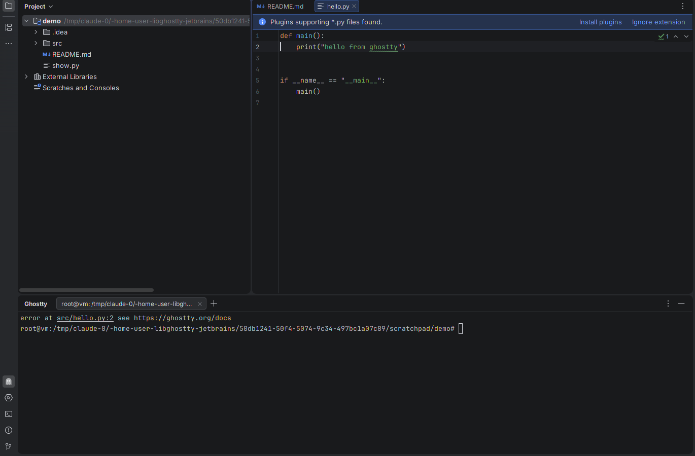
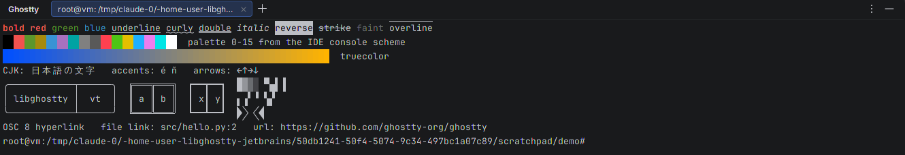
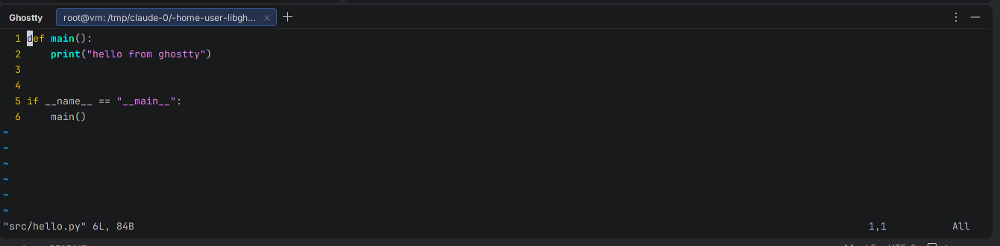
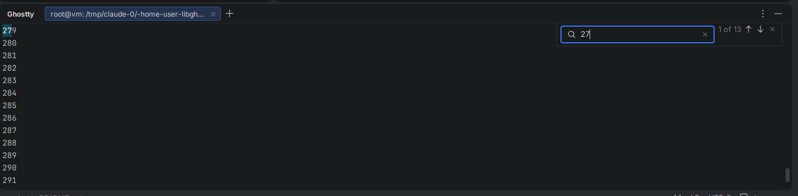

# Ghostty Terminal for JetBrains IDEs

A terminal for IntelliJ IDEA, PyCharm, GoLand, WebStorm, Rider, CLion and the other
JetBrains IDEs, built on [libghostty](https://ghostty.org): the terminal emulation
core of the [Ghostty](https://github.com/ghostty-org/ghostty) terminal.

All escape sequence parsing and terminal state (screen, scrollback, reflow, modes,
selection, search, key and mouse encoding) is done by **libghostty-vt**. The plugin
adds a pty, a Java2D renderer of libghostty's render state, and IDE integration.



| | |
|---|---|
|  |  |
|  | |

## Features

**Terminal emulation (libghostty-vt)**
- xterm-compatible VT parsing and state, 256 colors and truecolor, all SGR styles
  (curly/dotted/dashed/double underlines, underline colors, overline, strikethrough, faint)
- Kitty keyboard protocol, xterm `modifyOtherKeys`, application cursor/keypad modes
- Mouse reporting (X10, normal, button, any-event; SGR, SGR-pixels, UTF-8, urxvt)
- Synchronized output (mode 2026) without tearing, focus reporting, bracketed paste
- Grapheme clustering (emoji ZWJ sequences, flags, combining marks) and wide characters
- Reflow on resize and a scrollback limited by memory, not lines
- OSC 8 hyperlinks, OSC 7 working directory, OSC 52 clipboard, OSC 9/777 notifications,
  OSC 9;4 progress, OSC 133 semantic prompts, color scheme reports (mode 2031)

**IDE integration**
- *Ghostty* tool window with tabs, *New Ghostty Tab* and **Open in Ghostty Terminal** for
  any file or directory (Project view, editor tabs, *Open In* menu)
- Colors follow the IDE's console color scheme (or use Ghostty's defaults, or any
  Ghostty theme / config file) and update live when the scheme changes
- Font follows the editor's console font; zoom with <kbd>Ctrl</kbd>+wheel
- IDE shortcuts are sent to the terminal while it has focus (so <kbd>Ctrl</kbd>+<kbd>R</kbd>,
  <kbd>Ctrl</kbd>+<kbd>W</kbd>, <kbd>Esc</kbd>… reach your shell), except window and
  navigation actions like *Search Everywhere* or *Hide Active Window*
- <kbd>Ctrl</kbd>/<kbd>Cmd</kbd>+click URLs and `path/to/file.kt:12:3` references; files
  open in the editor at that line
- Find in screen and scrollback (<kbd>Ctrl</kbd>+<kbd>Shift</kbd>+<kbd>F</kbd> /
  <kbd>Cmd</kbd>+<kbd>F</kbd>), selection with Ghostty's click/double-click/triple-click
  and drag gestures, copy-on-select, middle-click paste on Linux
- Paste protection for text that would run commands, drag & drop files to paste paths
- Box-drawing, block elements and Powerline separators drawn geometrically so TUIs line
  up perfectly regardless of the font
- Program notifications become IDE notifications; progress reports show in the tab title

### Keyboard shortcuts in the terminal

| Action | Linux / Windows | macOS |
|---|---|---|
| Copy | <kbd>Ctrl</kbd>+<kbd>Shift</kbd>+<kbd>C</kbd> (or <kbd>Ctrl</kbd>+<kbd>C</kbd> with a selection) | <kbd>Cmd</kbd>+<kbd>C</kbd> |
| Paste | <kbd>Ctrl</kbd>+<kbd>Shift</kbd>+<kbd>V</kbd>, <kbd>Shift</kbd>+<kbd>Insert</kbd> | <kbd>Cmd</kbd>+<kbd>V</kbd> |
| Find | <kbd>Ctrl</kbd>+<kbd>Shift</kbd>+<kbd>F</kbd> | <kbd>Cmd</kbd>+<kbd>F</kbd> |
| Select all | context menu (<kbd>Ctrl</kbd>+<kbd>Shift</kbd>+<kbd>A</kbd> stays *Find Action*) | <kbd>Cmd</kbd>+<kbd>A</kbd> |
| New / close tab | <kbd>Ctrl</kbd>+<kbd>Shift</kbd>+<kbd>T</kbd> / <kbd>W</kbd> | <kbd>Cmd</kbd>+<kbd>T</kbd> / <kbd>W</kbd> |
| Font size | <kbd>Ctrl</kbd>+<kbd>Shift</kbd>+<kbd>=</kbd> / <kbd>-</kbd> / <kbd>0</kbd> | <kbd>Cmd</kbd>+<kbd>=</kbd> / <kbd>-</kbd> / <kbd>0</kbd> |
| Clear scrollback | context menu | <kbd>Cmd</kbd>+<kbd>K</kbd> |
| Scroll | <kbd>Shift</kbd>+<kbd>PgUp</kbd>/<kbd>PgDn</kbd>/<kbd>Home</kbd>/<kbd>End</kbd> | same |

Settings live in **Settings | Tools | Ghostty Terminal**.

## Architecture

```
┌──────────────────────── JetBrains IDE (JVM) ────────────────────────┐
│ GhosttyToolWindowFactory ─ GhosttyTerminalManager (tabs)            │
│        │                                                            │
│ GhosttyTerminalWidget ── TerminalPanel (input, selection, links)    │
│        │                    │   └─ TerminalRenderer (Java2D, boxes) │
│        │                    │                                       │
│ TerminalSession ── pty4j ── shell                                   │
│        │                                                            │
│ GhosttyTerminal (Kotlin, thread-safe) ── JNA                        │
└────────│────────────────────────────────────────────────────────────┘
         ▼
 libghostty-jb (C, ~25 functions)   native/src/ghostty_jb.{h,c}
         │  statically linked
         ▼
 libghostty-vt (Zig)                native/vendor/ghostty (git submodule)
```

The C API of libghostty-vt is rich, fine-grained and explicitly unstable. Instead of
binding it directly, the plugin talks to a small facade, **libghostty-jb**, which:

- exposes only primitives, pointers and `int32` lengths, so it's trivial to bind with
  JNA (bundled with every JetBrains IDE) and identical across 64-bit platforms;
- captures a whole frame in **one** native call (`gjb_snapshot`) into a flat `int32`
  buffer (cells, colors, attributes, cursor, scrollbar, selection and search
  highlights) instead of thousands of per-cell calls across the JVM boundary;
- owns libghostty policy that every embedder needs: device attribute replies,
  synchronized-output render holds with a timeout, the selection gesture state
  machine, incremental search;
- absorbs upstream API churn, so the Kotlin side only depends on
  [`ghostty_jb.h`](native/src/ghostty_jb.h).

Output from the shell is read on a background thread and fed straight into libghostty;
the UI is only told that something changed and pulls a frame when it paints, so
rendering is naturally rate-limited by Swing and heavy output never floods the EDT.
Libghostty's dirty tracking means an idle terminal costs nothing to repaint.

One shared library per platform (≈2 MB, no runtime dependencies beyond the C runtime)
is cross-compiled from a single machine with Zig and shipped inside the plugin as
`native/<os>-<arch>/`.

## Building

Requirements: JDK 21 and, for the native library, [Zig 0.16](https://ziglang.org/download/).

```sh
git clone --recursive https://github.com/nihaiden/libghostty-jetbrains
cd libghostty-jetbrains

./gradlew buildNativeHost      # native library for this machine -> native/dist/<os>-<arch>
./gradlew runIde               # launch a sandbox IDE with the plugin
./gradlew test                 # native-backed binding tests + headless rendering tests
./gradlew buildPlugin          # build/distributions/libghostty-jetbrains-<version>.zip
./gradlew verifyPlugin -PverifyIdes=2025.3.6,2026.2.3   # JetBrains Plugin Verifier
```

To build the native library for **every** platform (Linux x64/arm64 with glibc ≥ 2.28,
macOS x64/arm64 ≥ 11, Windows x64/arm64):

```sh
native/scripts/build-all.sh          # -> native/dist/{linux,darwin,windows}-{x64,aarch64}/
(cd native && zig build test)        # C tests of the facade
```

`buildPlugin` packages whatever is in `native/dist`. CI
([`.github/workflows/build.yml`](.github/workflows/build.yml)) builds all platforms,
runs the tests on Linux, macOS (arm64 and x64), Windows and Linux arm64, runs the
JetBrains Plugin Verifier and attaches the plugin zip to tagged releases.

During development you can point the plugin at any build of the library with
`-Dghostty.jb.library=/path/to/libghostty-jb.so` (or `GHOSTTY_JB_LIBRARY`).

> Behind a proxy where Zig can't download dependencies itself,
> `native/scripts/prefetch-zig-deps.sh native` fetches them with curl/git first.

### Updating libghostty

```sh
git -C native/vendor/ghostty fetch --depth 1 origin <commit> && git -C native/vendor/ghostty checkout <commit>
(cd native && zig build test)        # the facade's tests catch API changes
native/scripts/gen-kotlin-keys.py    # regenerate key codes if the key enum changed
```

## Project layout

| Path | What |
|---|---|
| `native/src/ghostty_jb.{h,c}` | The C facade over libghostty-vt |
| `native/test/test_main.c` | C tests for the facade |
| `native/build.zig` | Builds the shared library (and tests) against the submodule |
| `native/scripts/` | Cross-compile, dependency prefetch, key code generator |
| `src/main/kotlin/.../vt/` | JNA binding, `GhosttyTerminal`, frame decoding, key mapping |
| `src/main/kotlin/.../session/` | pty4j process, environment and shell detection |
| `src/main/kotlin/.../ui/` | Panel (input), renderer, fonts, theme, box drawing, find bar, links |
| `src/main/kotlin/.../toolwindow/` | Tool window and tab management |
| `src/main/kotlin/.../settings/` | Persistent settings and the settings page |

## Status and limitations

This is a young project. What has been verified:

- the native facade (C tests) and the Kotlin binding (JUnit, against the real library);
- headless rendering tests (cursor, colors, selection, box drawing, search overlay);
- end-to-end in IntelliJ IDEA 2025.3 on Linux: bash, vim, scrollback, search,
  selection, links, tabs, settings, ~7 MB/s of output while rendering.

Not yet done or known gaps:

- macOS and Windows libraries are cross-compiled and covered by CI binding tests, but the
  UI hasn't been exercised by hand on those systems yet (keyboard edge cases like dead
  keys and IME composition are the most likely to need work).
- Kitty graphics protocol images are parsed by libghostty but not drawn.
- No ligatures (cells are positioned individually, like most terminals by default).
- It's a separate tool window; it doesn't replace the IDE's built-in *Terminal*
  (there's no public extension point for a terminal engine).
- No shell integration scripts are injected; OSC 7 / OSC 133 work when your shell emits them.
- `TERM` is `xterm-256color` because `xterm-ghostty` terminfo is rarely installed.

## License

The plugin's own license is still to be chosen. libghostty is MIT licensed by Mitchell
Hashimoto and the Ghostty contributors; its license is shipped inside the plugin as
`native/LICENSE-ghostty`. "Ghostty" describes what the plugin is built on; this project is
not affiliated with or endorsed by the Ghostty project.
